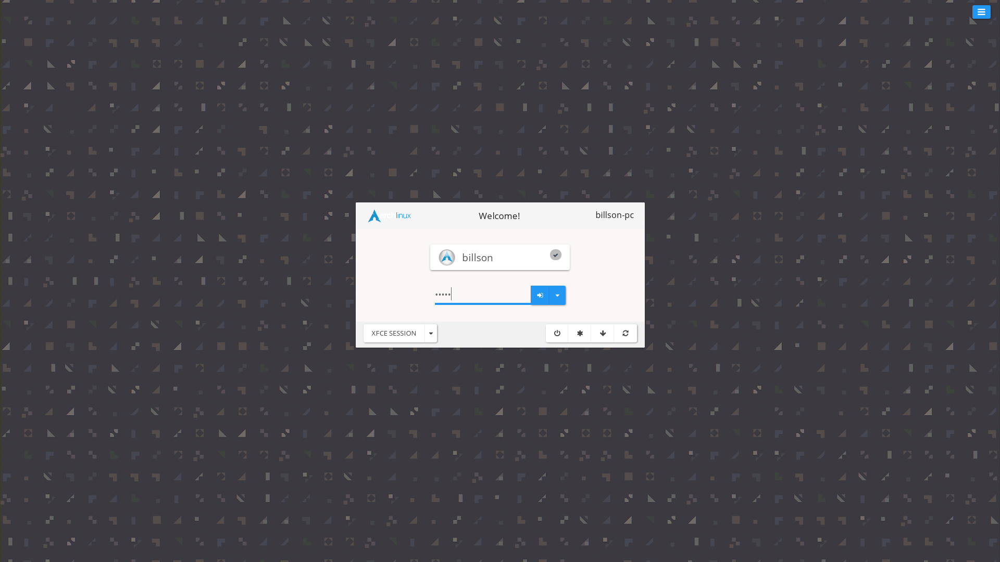
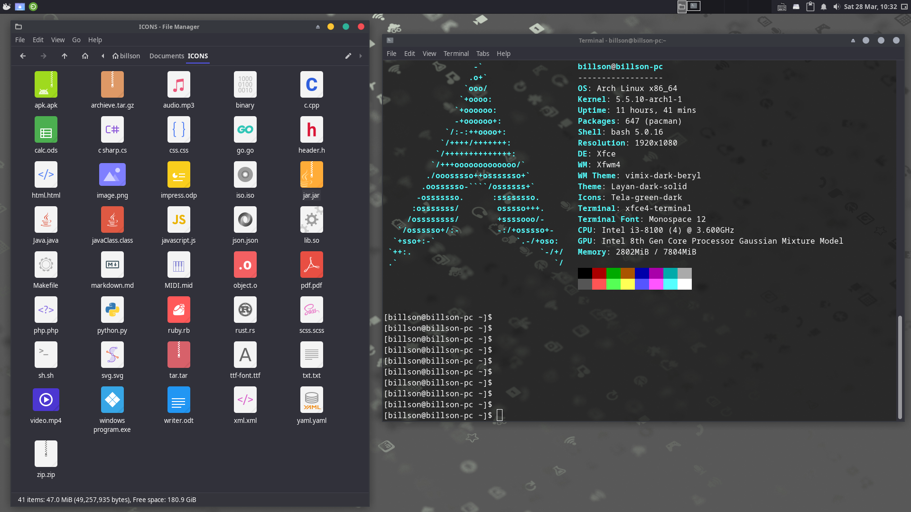
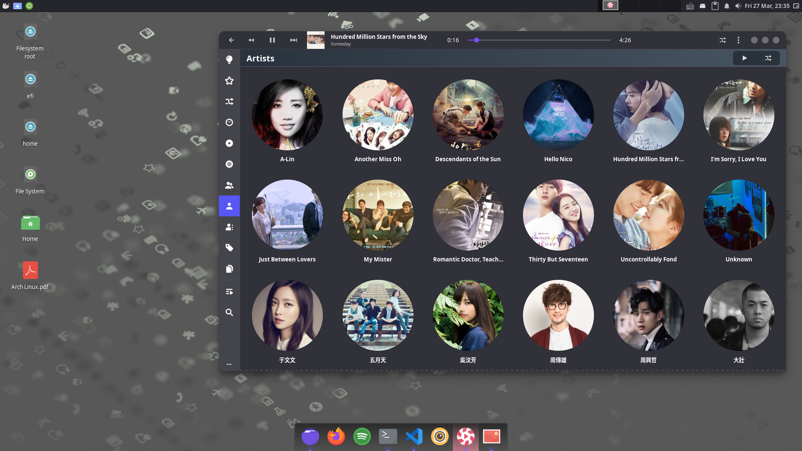
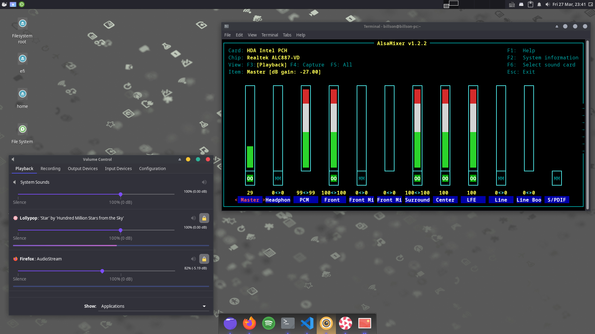
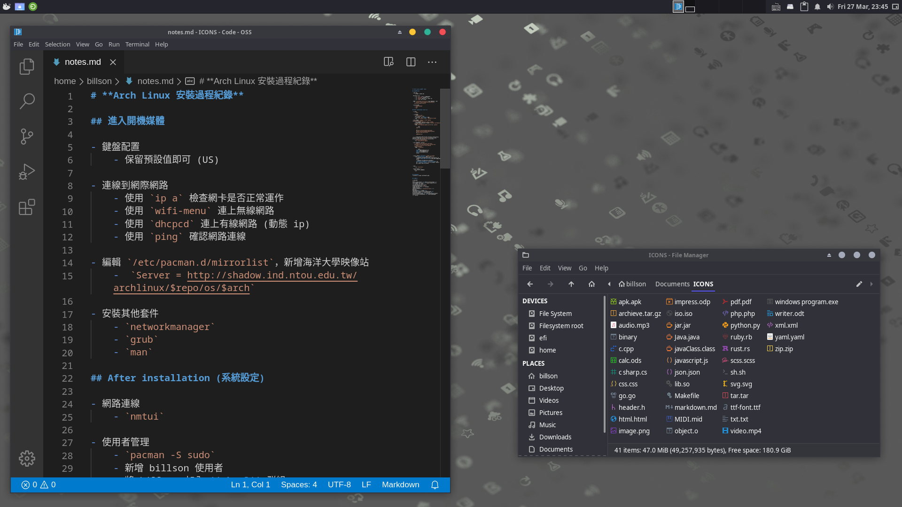

# **Arch Linux 安裝過程紀錄**

- **[安裝系統](#安裝系統)**
- **[系統設定](#系統設定)**
- **[桌面應用](#桌面應用)**
- **[桌面主題](#桌面主題)**
- **[字型設定](#字型設定)**
- **[JACK Audio Connection Kit](<#jack-audio-connection-kit>)**
- **[PipeWire](#PipeWire)**
- **[Screenshot](#Screenshot)**


## **安裝系統**

- 鍵盤配置

  - 保留預設值即可 (US)

* 連線到網際網路

  - 使用 `ip a` 檢查網卡是否正常運作
  - 使用 `wifi-menu` 連上無線網路
  - 使用 `dhcpcd` 連上有線網路 (動態 ip)
  - 使用 `ping` 確認網路連線

* 編輯 `/etc/pacman.d/mirrorlist`，新增海洋大學映像站

  ```
  Server = http://shadow.ind.ntou.edu.tw/archlinux/$repo/os/$arch
  ```

* 安裝系統 (linux 核心、驅動程式、基本工具程式)

  ```
  pacstrap /mnt base linux linux-firmware
  ```

* 執行 `arch-chroot /mnt` 之後，用 `pacman` 安裝其他套件

  ```
  pacman -S base-devel networkmanager man-db vim
  ```

* 安裝 Boot Loader/Manager (UEFI)

  - `pacman -S grub efibootmgr`
  - `--efi-directory` : **ESP** 分割區的掛載點

  <br>

  ```
  grub-install --target=x86_64-efi --efi-directory=/boot/efi --bootloader-id=ArchLinux
  ```

## **系統設定**

- 網路連線

  - `nmtui`

- 使用者管理

  - `pacman -S sudo`
  - 新增 billson 使用者
  - 將 billson 加入 **wheel** 群組
  - 編輯 `/etc/sudoers`，執行 `EDITOR=vim visudo`

- 安裝桌面環境

  ```
  pacman -S xfce4 xorg-server lightdm lightdm-webkit2-greeter
  ```

  - 啟用 lightdm `systemctl enable lightdm`
  - 下次開機時，直接進入圖形化界面 `systemctl set-default graphical.target`
  - 編輯 `/etc/lightdm/lightdm.conf`，設定 `greeter`

    ```yaml
    [Seat:*]
    ---

    ---
    #greeter-session=example-gtk-gnome
    greeter-session=lightdm-webkit2-greeter
    #greeter-hide-users=false
    ---
    [XDMCPServer]
    ```

- 在使用者家目錄下產生 Downloads Documents Desktop Music 等八個常用目錄 ([XDG user directories](https://wiki.archlinux.org/index.php/XDG_user_directories))

  - `pacman -S xdg-user-dirs`
  - 執行 `xdg-user-dirs-update`

- 安裝中文輸入法和其他字型

  ```
  pacman -S ttf-liberation noto-fonts noto-fonts-cjk noto-fonts-emoji terminus-font
  ```

  ```
  pacman -S fcitx-im fcitx-chewing fcitx-configtool
  ```

  - 編輯 `~/.xprofile`

    ```bash
    export XMODIFIERS=@im=fcitx
    export GTK_IM_MODULE=fcitx
    export QT_IM_MODULE=fcitx
    ```

- ALSA

  - `pacman -S alsa-utils`

- PulseAudio

  - `pacman -S pulseaudio pulseaudio-alsa pavucontrol`

## **桌面應用**

| 類別 | 套件 |
| --- | --- |
| Terminal Emulator | alacritty |
| File manager | thunar <br> thunar-archive-plugin <br> thunar-media-tags-plugin <br> thunar-volman <br> tumbler <br> gvfs <br> gvfs-mtp \* |
| Archieve Manager | file-roller |
| Programming | VS code (`code`) |
| Video and Audio | vlc <br> lollypop \* <br> spotify (AUR) |
| Image | viewnior |
| Office | LibreOffice (`libreoffice-fresh`) <br> okular |
| Disk | gparted <br> baobab <br> balena-etcher (AUR) |
| XFCE panel plugins | xfce4-clipman-plugin <br> xfce4-notifyd <br> xfce4-pulseaudio-plugin <br> xfce4-whiskermenu-plugin |
| Desktop Rice | plank <br> glava <br> rofi |
| Others | xfce4-screenshooter <br> xfce4-taskmanager <br> xfce4-screensaver <br> zenity \* <br> font-manager (AUR) <br> timeshift (AUR) |

<br>

> _\* lollypop 需要安裝可選擇的相依性套件才能播放音樂_
>
> ```
> Optional Deps:
> easytag: Modify tags
> gst-libav: FFmpeg plugin for GStreamer [installed]
> gst-plugins-bad: "Bad" plugin libraries [installed]
> gst-plugins-base: "Base" plugin libraries [installed]
> gst-plugins-good: "Good" plugin libraries [installed]
> gst-plugins-ugly: "Ugly" plugin libraries [installed]
> kid3-qt: Store covers in tags
> libsecret: Last.FM support [installed]
> python-pylast: Last.FM support
> youtube-dl: Youtube support
> ```
>
> _\* JUCE Framework 需要這個套件 [參考連結](https://forum.juce.com/t/native-filechooser-not-used-on-linux-xfce/26347)_
>
> _\* 讓電腦可以透過usb讀取手機檔案_

## **桌面主題**

- **GTK 應用程式主題**

  - 把 **GTK2/GTK3** 主題放在 `~/.themes` 目錄下
  - 把 **Icon** 主題放在 `~/.icons` 目錄下
  - 讓特定的程式使用不同的 GTK 主題

    可以透過修改 **Desktop entry** 來達到這個目的，系統的 **desktop files** 基本上都是放在 `/usr/share/applications/` 這個目錄下，使用者的則是放在 `~/.local/share/applications`。

    以 LibreOffice Writer 為例，複製 `libreoffice-writer.desktop` 到自己的家目錄下，並修改 `Exec` 的值：

    語法：`Exec=env GTK_THEME={theme_name}{commmand}`

    ```yaml
    [Desktop Entry]
    Version=1.0
    Terminal=false
    Icon=libreoffice-writer
    ...
    Exec=env GTK_THEME=vimix-beryl libreoffice --writer %U
    ...
    ...
    Actions=NewDocument;
    [Desktop Action NewDocument]
    Name=New Document
    ...
    Exec=env GTK_THEME=vimix-beryl libreoffice --writer
    ```

  - Reference

    - [GTK Theme](https://wiki.archlinux.org/index.php/GTK#Themes)
    - [Desktop entry](https://wiki.archlinux.org/index.php/Desktop_entries#Tips_and_tricks)

- **Qt / KDE / Kuantum 應用程式主題**

  - Xfce 桌面環境只能管理 GTK 主題，需要安裝額外的管理程式：

    ```
    pacman -S qt5ct kvantum-qt5
    ```

  - 設定環境變數

    `~/.xprofile`:

    ```bash
    export QT_QPA_PLATFORMTHEME=qt5ct
    ```

  - 設定主題

    執行 `qt5ct`，在 **Appearance** 的頁籤把 **Style** 選項設為 **kvantum**，接著開啟 **Kvantum Manager**，選擇 **KvGnomeDark** 作為預設主題，也可以進到 **Application Themes** 頁籤，為特定的應用程式套用不同的主題

  - Reference
    - [Qt Theme](https://wiki.archlinux.org/index.php/Qt#Configuration_of_Qt5_apps_under_environments_other_than_KDE_Plasma)

## **字型設定**

- Arch Linux 預設的字型設定對中文不是很友善，不採用它的設定，刪除 `conf.d` 中的連結檔

  ```
  rm /etc/fonts/conf.d/60-latin.conf /etc/fonts/conf.d/65-nonlatin.conf
  ```

- Noto CJK 字型的設定檔 `/etc/fonts/conf.avail/70-noto-cjk.conf` 預設沒有啟用，複製一份到自己的家目錄下來啟用這個設定

- 設定偏好字型，以無襯線字體為例

  ```xml
  <alias>
     <family>sans-serif</family> <!-- sans -->
     <prefer>
       <!-- latin fonts -->
       <family>Liberation Sans</family>
       <family>Roboto</family>
       <family>Ubuntu</family>
       <family>DejaVu Sans</family>
       <family>Bitstream Vera Sans</family>
       <family>Noto Sans</family>

       <!-- chinese fonts -->
       <family>Noto Sans CJK TC</family>
       <family>WenQuanYi Micro Hei</family>
       <family>WenQuanYi Zen Hei</family>
       <family>jf-openhuninn-1.0</family>

       <!-- emoji fonts -->
       <family>Noto Color Emoji</family>

       <!-- iconic patched fonts: (Font Awesome, powerline) -->
       <family>Hack Nerd Font Mono</family>
       <family>FiraCode Nerd Font Mono</family>
     </prefer>
  </alias>
  ```

- 將設定檔放在家目錄下 `~/.config/fontconfig/conf.d`

  - `10-noto-cjk.conf` CJK 字型設定，數字較小，優先序校高
  - `30-prefered-fonts.conf` 偏好字型

- 使用 `fc-match` 觀察設定結果

  - 預設使用拉丁字型

    ```
    $ fc-match sans
    LiberationSans-Regular.ttf: "Liberation Sans" "Regular"
    ```

  - Noto CJK 中韓日字型對於相同的字有不同的設計，若沒有指定語言，預設使用繁體中文字型( `ff0c` 是中文全形逗號的 unicode 編碼)

    ```
    $ fc-match sans:charset=ff0c
    NotoSansCJK-Regular.ttc: "Noto Sans CJK TC" "Regular"
    ```

  - 若有指定語言，則使用對應的字體

    ```
    $ fc-match sans:lang=zh-cn
    NotoSansCJK-Regular.ttc: "Noto Sans CJK SC" "Regular"
    ```

- Firefox 字型設定，進到 **Preferences** 頁面

  - Language and Appearance/Fonts and Colors：

    進入 Advanced 對話框 ，為不同的語言設定不同的字體

  - Language and Appearance/Language：將 **preferred language for displaying pages** 更改為 **Chinese (Taiwan) [zh-tw]**，讓維基百科能優先使用繁體中文顯示中文頁面

- Refefence

  - [Manjaro 字型設定折騰記 (上)](https://archer1609wp.wordpress.com/2018/10/23/manjaro-font-config-1/)
  - [Fontconfig Documentation](https://www.freedesktop.org/software/fontconfig/fontconfig-user.html)

## **JACK Audio Connection Kit**

- 安裝：

  ```
  pacman -S jack2 a2jmidid pulseaudio-jack jack_capture realtime-privileges cadence
  ```

- 把使用者加進 **audio** 和 **realtime** 群組：

  ```
  usermod -G realtime,audio -a billson
  ```

## **PipeWire**

## **Screenshot**










